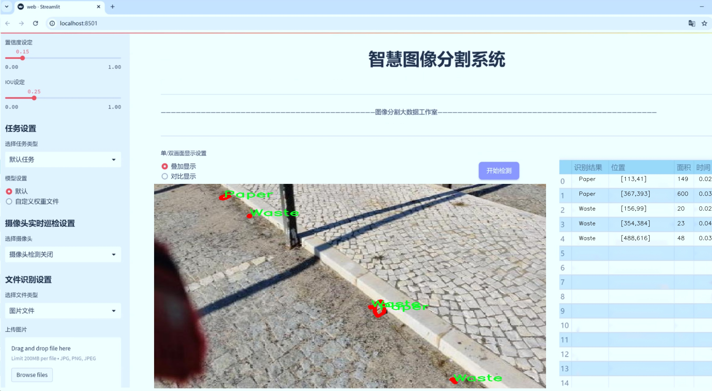
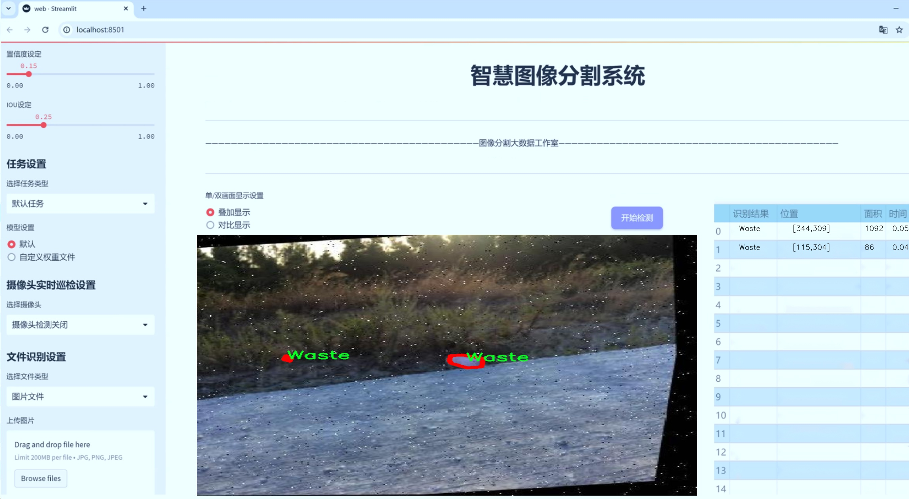
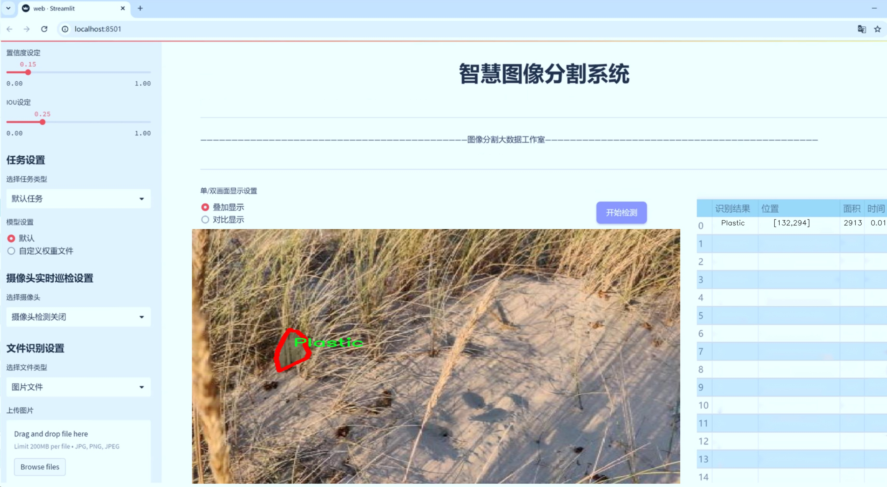
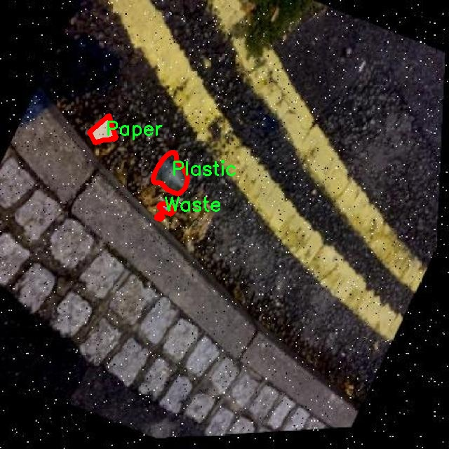
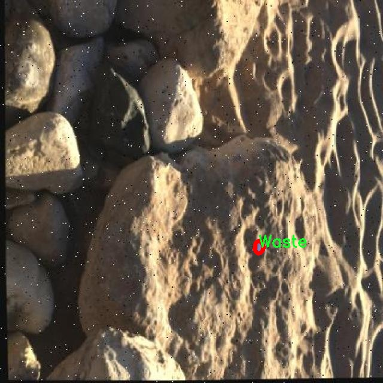
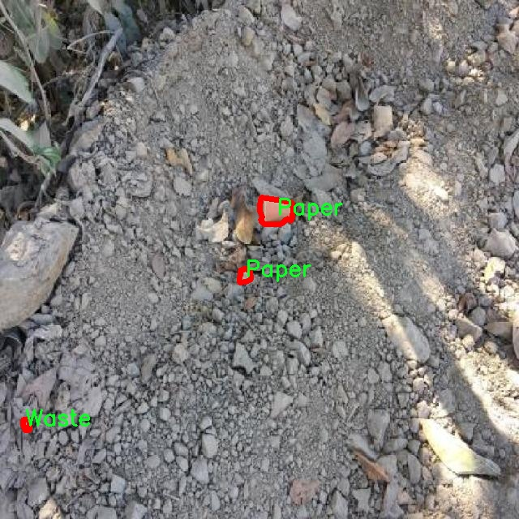
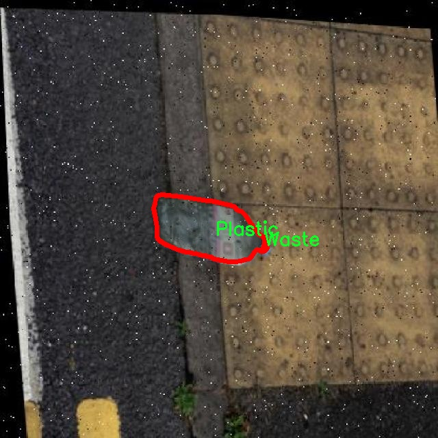
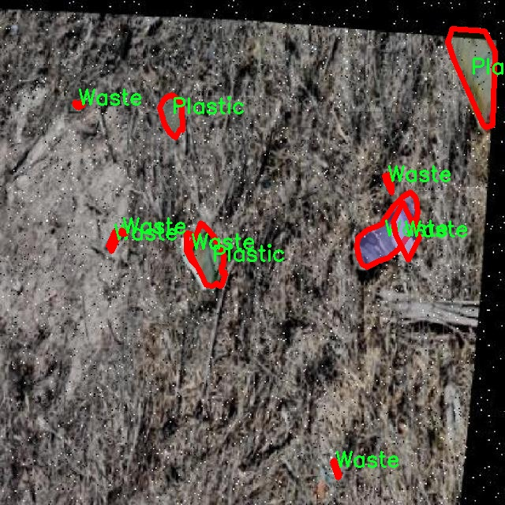

# 日常场景垃圾识别图像分割系统： yolov8-seg-AIFI

### 1.研究背景与意义

[参考博客](https://gitee.com/YOLOv8_YOLOv11_Segmentation_Studio/projects)

[博客来源](https://kdocs.cn/l/cszuIiCKVNis)

研究背景与意义

随着城市化进程的加快和人们生活水平的提高，日常生活中产生的垃圾种类和数量日益增加，垃圾管理和分类成为了现代社会面临的重要挑战。有效的垃圾分类不仅有助于资源的回收利用，还能减少环境污染，促进可持续发展。因此，开发高效的垃圾识别与分类系统，尤其是在日常场景中，显得尤为重要。近年来，深度学习技术的迅猛发展为图像识别和分割提供了新的解决方案，其中YOLO（You Only Look Once）系列模型因其高效性和实时性，广泛应用于物体检测和图像分割任务。

本研究旨在基于改进的YOLOv8模型，构建一个针对日常场景垃圾的识别与图像分割系统。通过对IA beachbot 2数据集的分析，该数据集包含2500张图像，涵盖12种垃圾类别，包括玻璃、金属、纸张、塑料、废弃物、纸板、织物等。这些类别的多样性为系统的训练和测试提供了丰富的样本，能够有效提升模型的泛化能力和准确性。针对这些垃圾的有效识别与分割，不仅能够提高垃圾分类的效率，还能为后续的智能垃圾处理系统提供数据支持。

在技术层面，YOLOv8作为最新一代的YOLO模型，具备更高的检测精度和更快的处理速度。通过对YOLOv8的改进，可以针对日常场景中的垃圾特征进行优化，提升模型在复杂背景下的表现。尤其是在光照变化、遮挡和不同角度的情况下，改进后的模型能够更好地识别和分割目标物体，减少误检和漏检的情况。此外，图像分割技术的引入，使得系统不仅能够识别垃圾的类别，还能精确定位其在图像中的位置，为后续的自动化处理提供了基础。

本研究的意义不仅在于技术的创新，更在于其对社会环境的积极影响。通过建立高效的垃圾识别与分割系统，可以有效提升公众的垃圾分类意识，促进社会对垃圾分类的参与度。同时，该系统的应用也将为城市垃圾管理提供科学依据，帮助政府和相关部门制定更为合理的垃圾处理政策，推动城市环境的可持续发展。

综上所述，基于改进YOLOv8的日常场景垃圾识别图像分割系统的研究，不仅具有重要的学术价值，更具备广泛的社会应用前景。通过该系统的开发与实施，将为解决日益严峻的垃圾处理问题提供有效的技术支持，推动社会向更加环保和可持续的方向发展。

### 2.图片演示







注意：本项目提供完整的训练源码数据集和训练教程,由于此博客编辑较早,暂不提供权重文件（best.pt）,需要按照6.训练教程进行训练后实现上图效果。

### 3.视频演示

[3.1 视频演示](https://www.bilibili.com/video/BV1oTUPYeEiV/)

### 4.数据集信息

##### 4.1 数据集类别数＆类别名

nc: 5
names: ['Glass', 'Metal', 'Paper', 'Plastic', 'Waste']


##### 4.2 数据集信息简介

数据集信息展示

在当今环境保护日益受到重视的背景下，垃圾分类与识别技术的研究变得尤为重要。为此，我们构建了一个专门用于训练改进YOLOv8-seg的日常场景垃圾识别图像分割系统的数据集，命名为“IA beachbot 2”。该数据集旨在为自动化垃圾分类提供高质量的图像数据支持，助力于提升机器学习模型在实际应用中的准确性和效率。

“IA beachbot 2”数据集包含五个主要类别，分别是玻璃、金属、纸张、塑料和其他废弃物。这五个类别的选择不仅反映了日常生活中常见的垃圾类型，还涵盖了当前垃圾分类的主要目标。每个类别的图像都经过精心挑选和标注，确保模型在训练过程中能够学习到不同物质的特征和形态，从而实现更为精准的识别与分割。

在数据集的构建过程中，我们注重多样性和代表性，确保每个类别的样本都能够涵盖不同的形状、颜色和纹理。例如，玻璃类样本不仅包括常见的瓶子，还涵盖了碎片和不同颜色的玻璃制品；金属类样本则包括铝罐、铁罐以及其他金属物品；纸张类样本则涉及报纸、纸箱和其他纸制品；塑料类样本则包括各种塑料瓶、袋子和容器；而“废弃物”类别则是对无法归类的杂物进行的统称。这种多样化的样本选择有助于模型在面对现实世界中的复杂情况时，能够更好地进行识别和处理。

此外，数据集中的图像经过精细的预处理，以确保其在不同光照、角度和背景下的适应性。我们采用了数据增强技术，如旋转、缩放、裁剪和颜色调整等，以增加数据集的丰富性和鲁棒性。这些技术不仅提高了模型的泛化能力，还有效地防止了过拟合现象的发生。

在数据标注方面，我们使用了先进的图像分割工具，确保每个类别的物体都被准确地标记。每个图像的标注信息都与其对应的类别标签紧密关联，形成了一个完整的标注体系。这种精确的标注不仅为模型的训练提供了坚实的基础，也为后续的评估和测试提供了可靠的数据支持。

总之，“IA beachbot 2”数据集的构建不仅为改进YOLOv8-seg的日常场景垃圾识别图像分割系统提供了丰富的训练素材，也为未来的垃圾分类研究和应用奠定了基础。通过这一数据集，我们希望能够推动智能垃圾分类技术的发展，为环境保护贡献一份力量。











### 5.项目依赖环境部署教程（零基础手把手教学）

[5.1 环境部署教程链接（零基础手把手教学）](https://www.bilibili.com/video/BV1jG4Ve4E9t/?vd_source=bc9aec86d164b67a7004b996143742dc)


[5.2 安装Python虚拟环境创建和依赖库安装视频教程链接（零基础手把手教学）](https://www.bilibili.com/video/BV1nA4VeYEze/?vd_source=bc9aec86d164b67a7004b996143742dc)

### 6.手把手YOLOV8-seg训练视频教程（零基础手把手教学）

[6.1 手把手YOLOV8-seg训练视频教程（零基础小白有手就能学会）](https://www.bilibili.com/video/BV1cA4VeYETe/?vd_source=bc9aec86d164b67a7004b996143742dc)


按照上面的训练视频教程链接加载项目提供的数据集，运行train.py即可开始训练



     Epoch   gpu_mem       box       obj       cls    labels  img_size
     1/200     0G   0.01576   0.01955  0.007536        22      1280: 100%|██████████| 849/849 [14:42<00:00,  1.04s/it]
               Class     Images     Labels          P          R     mAP@.5 mAP@.5:.95: 100%|██████████| 213/213 [01:14<00:00,  2.87it/s]
                 all       3395      17314      0.994      0.957      0.0957      0.0843

     Epoch   gpu_mem       box       obj       cls    labels  img_size
     2/200     0G   0.01578   0.01923  0.007006        22      1280: 100%|██████████| 849/849 [14:44<00:00,  1.04s/it]
               Class     Images     Labels          P          R     mAP@.5 mAP@.5:.95: 100%|██████████| 213/213 [01:12<00:00,  2.95it/s]
                 all       3395      17314      0.996      0.956      0.0957      0.0845

     Epoch   gpu_mem       box       obj       cls    labels  img_size
     3/200     0G   0.01561    0.0191  0.006895        27      1280: 100%|██████████| 849/849 [10:56<00:00,  1.29it/s]
               Class     Images     Labels          P          R     mAP@.5 mAP@.5:.95: 100%|███████   | 187/213 [00:52<00:00,  4.04it/s]
                 all       3395      17314      0.996      0.957      0.0957      0.0845


### 7.50+种全套YOLOV8-seg创新点加载调参实验视频教程（一键加载写好的改进模型的配置文件）

[7.1 50+种全套YOLOV8-seg创新点加载调参实验视频教程（一键加载写好的改进模型的配置文件）](https://www.bilibili.com/video/BV1Hw4VePEXv/?vd_source=bc9aec86d164b67a7004b996143742dc)

### YOLOV8-seg算法简介

原始YOLOv8-seg算法原理

YOLOv8-seg算法是YOLO系列模型的最新版本，代表了计算机视觉领域中目标检测与实例分割任务的前沿技术。该算法的设计旨在提高检测精度和速度，尤其是在复杂环境下的小目标检测。与之前的YOLO版本相比，YOLOv8采用了anchor-free的检测方法，这一创新使得模型在处理多样化背景和复杂特征的小目标时，能够显著提升感知能力和定位精度。

YOLOv8-seg的网络结构主要由四个模块组成：输入端、主干网络、Neck端和输出端。输入端通过Mosaic数据增强、自适应图片缩放和灰度填充等方式对输入图像进行预处理，以提高模型的鲁棒性和泛化能力。主干网络则负责特征提取，采用了Conv、C2f和SPPF等结构，通过卷积和池化操作提取图像的多层次特征。特别是C2f模块的引入，使得特征提取过程中能够更好地保留细粒度的上下文信息，这对于小目标的检测尤为重要。

在Neck端，YOLOv8-seg采用了基于PAN（Path Aggregation Network）结构的设计，通过上采样、下采样和特征拼接等操作，实现了不同尺度特征图的有效融合。这一过程确保了模型在处理不同大小目标时，能够充分利用多层次的特征信息，从而提升检测的准确性。输出端则采用了decoupled head结构，解耦了分类和回归过程，使得模型在进行目标检测时能够更加灵活和高效。

YOLOv8-seg在损失函数的设计上也进行了创新，使用了MPDIoU（Multi-Point Distance Intersection over Union）损失函数替代了传统的CIoU损失函数。这一变化不仅提高了模型的泛化能力，还在一定程度上提升了定位精度，尤其是在复杂背景下的小目标检测中，能够有效减少定位误差。

尽管YOLOv8-seg在设计上做出了诸多改进，但在复杂水面环境下，仍然面临着小目标漂浮物特征复杂、背景多样等挑战。为了解决这些问题，研究者们提出了YOLOv8-WSSOD算法，进一步增强了YOLOv8-seg的性能。该算法通过引入BiFormer双层路由注意力机制，构建了C2fBF模块，以减轻主干网络下采样过程中的噪声影响，从而保留更多的上下文信息。此外，针对小目标漏检问题，YOLOv8-WSSOD还添加了一个更小的检测头，以提升网络对小目标的感知能力，并在Neck端引入GSConv和Slim-neck技术，以保持精度的同时降低计算量。

YOLOv8-seg的设计理念和实现方法，充分体现了现代计算机视觉领域对高效、精准的目标检测与分割技术的追求。通过结合多种先进的技术手段，YOLOv8-seg不仅在检测精度和速度上超越了以往的模型，更在实际应用中展现出了良好的适应性和灵活性。这使得YOLOv8-seg成为了当前最为流行和成功的目标检测与实例分割模型之一，为各类视觉任务提供了强有力的支持。

总之，YOLOv8-seg算法通过其创新的网络结构、灵活的损失函数设计以及对小目标检测的针对性改进，展示了在复杂环境下的强大能力。随着研究的深入和技术的不断演进，YOLOv8-seg及其衍生算法有望在未来的计算机视觉应用中发挥更大的作用，推动目标检测与实例分割技术的进一步发展。


### 9.系统功能展示（检测对象为举例，实际内容以本项目数据集为准）

图9.1.系统支持检测结果表格显示

  图9.2.系统支持置信度和IOU阈值手动调节

  图9.3.系统支持自定义加载权重文件best.pt(需要你通过步骤5中训练获得)

  图9.4.系统支持摄像头实时识别

  图9.5.系统支持图片识别

  图9.6.系统支持视频识别

  图9.7.系统支持识别结果文件自动保存

  图9.8.系统支持Excel导出检测结果数据


### 10.50+种全套YOLOV8-seg创新点原理讲解（非科班也可以轻松写刊发刊，V11版本正在科研待更新）

#### 10.1 由于篇幅限制，每个创新点的具体原理讲解就不一一展开，具体见下列网址中的创新点对应子项目的技术原理博客网址【Blog】：


[10.1 50+种全套YOLOV8-seg创新点原理讲解链接](https://gitee.com/qunmasj/good)

#### 10.2 部分改进模块原理讲解(完整的改进原理见上图和技术博客链接)【如果此小节的图加载失败可以通过CSDN或者Github搜索该博客的标题访问原始博客，原始博客图片显示正常】
### YOLOv8简介
YOLOv8目标检测算法继承了YOLOv1系列的思考,是一种新型端到端的目标检测算法,尽管现在原始检测算法已经开源,但是鲜有发表的相关论文.YOLOv8的网络结构如图所示,主要可分为Input输入端、Backbone骨干神经网络、Neck 混合特征网络层和Head预测层网络共4个部分.

YOLO目标检测算法是一种端到端的One-Slage 目标检测算法，其核心思想是将图像按区域分块进行预测。YOLO将输入图像按照32x32的大小划分成若干个网格，例如416x416的图像将被划分为13x13个网格。当目标物体的中心位于某个网格内时,该网格就会负责输出该物体的边界框和类别置信度。每个网格可以预测多个边界框和多个目标类别,这些边界框和类别的数量可以根据需要进行设置。YOLO算法的输出是一个特征图,包含了每个网格对应的边界框和类别置信度的信息呵。本文采用YOLO最新的YOLOv8模型，其是2022年底发布的最新YOLO系列模型，采用全新的SOTA模型，全新的网络主干结构,如图1所示。
整个网络分为Backbone 骨干网络部分和Head头部网络部分。YOLOv8汲取了前几代网络的优秀特性，骨干网络和 Neck部分遵循CSP的思想，将YOLOv5中的C3模块被替换成了梯度流更丰富C2模块,去掉YOLOv5中 PAN-FPN上采样阶段中的卷积结构,将Backbone不同阶段输出的特征直接送入了上采样操作,模型提供了N/S/M/L/X尺度的不同大小模型,能够满足不同领域业界的需求。本文基于YOLOv8模型设计番茄病虫害检测系统，通过配置模型参数训练番茄图像,得到能够用于部署应用的最优模型。


### 感受野注意力卷积（RFAConv)
#### 标准卷积操作回顾
标准的卷积操作是构造卷积神经网络的基本构件。它利用具有共享参数的滑动窗口提取特征信息，克服了全连通层构造神经网络固有的参数多、计算开销大的问题。设 X R∈C×H×W
表示输入特征图，其中C、H、W分别表示特征图的通道数、高度、宽度。为了清楚地演示卷积核的特征提取过程，我们使用 C = 1 的例子。从每个接受域滑块中提取特征信息的卷积运算可以表示为:


这里，Fi 表示计算后每个卷积滑块得到的值，Xi 表示每个滑块内对应位置的像素值，K表示卷积核，S表示卷积核中的参数个数，N表示接收域滑块的总数。可以看出，每个滑块内相同位置的 feature共享相同的参数Ki。因此，标准的卷积运算并不能捕捉到不同位置所带来的信息差异，这最终在一定程度上限制了卷积神经网络的性能。 

#### 空间注意力回顾
目前，空间注意机制是利用学习得到的注意图来突出每个特征的重要性。与前一节类似，这里以 C=1为例。突出关键特征的空间注意机制可以简单表述为:这里，Fi 表示加权运算后得到的值。xi 和Ai 表示输入特征图和学习到的注意图在不同位置的值，N为输入特征图的高和宽的乘积，表示像素值的总数。


#### 空间注意与标准卷积运算
将注意力机制整合到卷积神经网络中，可以提高卷积神经网络的性能。通过对标准卷积运算和现有空间注意机制的研究，我们认为空间注意机制有效地克服了卷积神经网络固有的参数共享的局限性。目前卷积神经网络中最常用的核大小是 1 × 1和3 × 3。在引入空间注意机制后，提取特征的卷积操作可以是 1 × 1或3 × 3卷积操作。为了直观地展示这个过程，在 1 × 1卷积运算的前面插入了空间注意机制。通过注意图对输入特征图(Re-weight“×”)进行加权运算，最后通过 1 × 1卷积运算提取接收域的滑块特征信息。整个过程可以简单地表示如下:


 这里卷积核K仅代表一个参数值。如果取A i× ki 的值作为一种新的卷积核参数，有趣的是它解决了 1×1卷积运算提取特征时的参数共享问题。然而，关于空间注意机制的传说到此结束。当空间注意机制被插入到3×3卷积运算前面时。具体情况如下:


如上所述，如果取A的值 i × ki (4)式作为一种新的卷积核参数，完全解决了大规模卷积核的参数共享问题。然而，最重要的一点是，卷积核在提取每个接受域滑块的特征时，会共享一些特征。换句话说，每个接收域滑块内都有一个重叠。仔细分析后会发现A12= a21， a13 = a22， a15 = a24……，在这种情况下，每个滑动窗口共享空间注意力地图的权重。因此，空间注意机制没有考虑整个接受域的空间特征，不能有效地解决大规模卷积核的参数共享问题。因此，空间注意机制的有效性受到限制。 

#### 创新空间注意力和标准卷积操作
该博客提出解决了现有空间注意机制的局限性，为空间处理提供了一种创新的解决方案。受RFA的启发，一系列空间注意机制被开发出来，可以进一步提高卷积神经网络的性能。RFA可以看作是一个轻量级即插即用模块，RFA设计的卷积运算(RFAConv)可以代替标准卷积来提高卷积神经网络的性能。因此，我们预测空间注意机制与标准卷积运算的结合将继续发展，并在未来带来新的突破。
接受域空间特征:为了更好地理解接受域空间特征的概念，我们将提供相关的定义。接收域空间特征是专门为卷积核设计的，并根据核大小动态生成。如图1所示，以3×3卷积核为例。在图1中，“Spatial Feature”指的是原始的Feature map。“接受域空间特征”是空间特征变换后的特征图。

 

由不重叠的滑动窗口组成。当使用 3×3卷积内核提取特征时，接收域空间特征中的每个 3×3大小窗口代表一个接收域滑块。接受域注意卷积(RFAConv):针对接受域的空间特征，我们提出了接受域注意卷积(RFA)。该方法不仅强调了接收域滑块内不同特征的重要性，而且对接收域空间特征进行了优先排序。通过该方法，完全解决了卷积核参数共享的问题。接受域空间特征是根据卷积核的大小动态生成的，因此，RFA是卷积的固定组合，不能与卷积操作的帮助分离，卷积操作同时依赖于RFA来提高性能，因此我们提出了接受场注意卷积(RFAConv)。具有3×3大小的卷积核的RFAConv整体结构如图所示。


目前，最广泛使用的接受域特征提取方法是缓慢的。经过大量的研究，我们开发了一种快速的方法，用分组卷积来代替原来的方法。具体来说，我们利用相应大小的分组卷积来动态生成基于接受域大小的展开特征。尽管与原始的无参数方法(如PyTorch提供的nn.())相比，该方法增加了一些参数，但它的速度要快得多。注意:如前一节所述，当使用 3×3卷积内核提取特征时，接收域空间特征中的每个 3×3大小窗口表示一个接收域滑块。而利用快速分组卷积提取感受野特征后，将原始特征映射为新的特征。最近的研究表明。交互信息可以提高网络性能，如[40,41,42]所示。同样，对于RFAConv来说，通过交互接受域特征信息来学习注意图可以提高网络性能。然而，与每个接收域特征交互会导致额外的计算开销，因此为了最小化计算开销和参数的数量，我们使用AvgPool来聚合每个接收域特征的全局信息。然后，使用 1×1 组卷积操作进行信息交互。最后，我们使用softmax来强调每个特征在接受域特征中的重要性。一般情况下，RFA的计算可以表示为:


这里gi×i 表示一个大小为 i×i的分组卷积，k表示卷积核的大小，Norm表示归一化，X表示输入的特征图，F由注意图 a相乘得到 rf 与转换后的接受域空间特征 Frf。与CBAM和CA不同，RFA能够为每个接受域特征生成注意图。卷积神经网络的性能受到标准卷积操作的限制，因为卷积操作依赖于共享参数，对位置变化带来的信息差异不敏感。然而，RFAConv通过强调接收域滑块中不同特征的重要性，并对接收域空间特征进行优先级排序，可以完全解决这个问题。通过RFA得到的feature map是接受域空间特征，在“Adjust Shape”后没有重叠。因此，学习到的注意图将每个接受域滑块的特征信息聚合起来。换句话说，注意力地图不再共享在每个接受域滑块。这完全弥补了现有 CA和CBAM注意机制的不足。RFA为标准卷积内核提供了显著的好处。而在调整形状后，特征的高度和宽度是 k倍，需要进行 stride = k的k × k卷积运算来提取特征信息。RFA设计的卷积运算RFAConv为卷积带来了良好的增益，对标准卷积进行了创新。
此外，我们认为现有的空间注意机制应该优先考虑接受域空间特征，以提高网络性能。众所周知，基于自注意机制的网络模型[43,44,45]取得了很大的成功，因为它解决了卷积参数共享的问题，并对远程信息进行建模。然而，自注意机制也为模型引入了显著的计算开销和复杂性。我们认为，将现有的空间注意机制的注意力引导到接受场空间特征上，可以以类似于自我注意的方式解决长期信息的参数共享和建模问题。与自我关注相比，这种方法需要的参数和计算资源少得多。答案如下:(1)将以接收场空间特征为中心的空间注意机制与卷积相结合，消除了卷积参数共享的问题。(2)现有的空间注意机制已经考虑了远程信息，可以通过全局平均池或全局最大池的方式获取全局信息，其中明确考虑了远程信息。因此，我们设计了新的 CBAM和CA模型，称为RFCBAM和RFCA，它们专注于接受域空间特征。与RFA类似，使用最终的k × k stride = k 的卷积运算来提取特征信息。这两种新的卷积方法的具体结构如图 3所示，我们称这两种新的卷积操作为 RFCBAMConv和RFCAConv。与原来的CBAM相比，我们在RFCBAM中使用SE attention来代替CAM。因为这样可以减少计算开销。此外，在RFCBAM中，通道注意和空间注意不是分开执行的。相反，它们是同时加权的，使得每个通道获得的注意力地图是不同的。


### 11.项目核心源码讲解（再也不用担心看不懂代码逻辑）

#### 11.1 ultralytics\models\yolo\segment\predict.py

以下是经过精简和注释的核心代码部分，主要保留了 `SegmentationPredictor` 类及其关键方法 `postprocess` 的实现。

```python
# Ultralytics YOLO 🚀, AGPL-3.0 license

from ultralytics.engine.results import Results
from ultralytics.models.yolo.detect.predict import DetectionPredictor
from ultralytics.utils import DEFAULT_CFG, ops

class SegmentationPredictor(DetectionPredictor):
    """
    扩展自 DetectionPredictor 类，用于基于分割模型的预测。
    """

    def __init__(self, cfg=DEFAULT_CFG, overrides=None, _callbacks=None):
        """初始化 SegmentationPredictor，设置配置、覆盖参数和回调函数。"""
        super().__init__(cfg, overrides, _callbacks)  # 调用父类构造函数
        self.args.task = 'segment'  # 设置任务类型为分割

    def postprocess(self, preds, img, orig_imgs):
        """
        对每个输入图像的预测结果进行后处理，包括非极大值抑制和掩膜处理。
        
        参数:
        preds: 模型的预测结果
        img: 输入图像
        orig_imgs: 原始输入图像
        """
        # 应用非极大值抑制，过滤掉重叠的检测框
        p = ops.non_max_suppression(preds[0],
                                     self.args.conf,  # 置信度阈值
                                     self.args.iou,   # IOU 阈值
                                     agnostic=self.args.agnostic_nms,  # 是否使用类别无关的 NMS
                                     max_det=self.args.max_det,  # 最大检测框数量
                                     nc=len(self.model.names),  # 类别数量
                                     classes=self.args.classes)  # 选择的类别

        # 如果输入图像不是列表，则将其转换为 numpy 数组
        if not isinstance(orig_imgs, list):
            orig_imgs = ops.convert_torch2numpy_batch(orig_imgs)

        results = []  # 存储结果的列表
        # 获取预测结果中的掩膜原型
        proto = preds[1][-1] if len(preds[1]) == 3 else preds[1]  
        
        # 遍历每个预测结果
        for i, pred in enumerate(p):
            orig_img = orig_imgs[i]  # 获取原始图像
            img_path = self.batch[0][i]  # 获取图像路径
            
            if not len(pred):  # 如果没有检测到框
                masks = None  # 掩膜设置为 None
            elif self.args.retina_masks:  # 如果使用 Retina 掩膜
                # 缩放检测框到原始图像大小
                pred[:, :4] = ops.scale_boxes(img.shape[2:], pred[:, :4], orig_img.shape)
                # 处理掩膜
                masks = ops.process_mask_native(proto[i], pred[:, 6:], pred[:, :4], orig_img.shape[:2])  # HWC
            else:  # 否则使用常规掩膜处理
                masks = ops.process_mask(proto[i], pred[:, 6:], pred[:, :4], img.shape[2:], upsample=True)  # HWC
                # 缩放检测框到原始图像大小
                pred[:, :4] = ops.scale_boxes(img.shape[2:], pred[:, :4], orig_img.shape)
            
            # 将结果添加到结果列表中
            results.append(Results(orig_img, path=img_path, names=self.model.names, boxes=pred[:, :6], masks=masks))
        
        return results  # 返回处理后的结果
```

### 代码注释说明：
1. **类的定义**：`SegmentationPredictor` 类继承自 `DetectionPredictor`，用于处理分割任务。
2. **构造函数**：初始化时调用父类构造函数，并设置任务类型为分割。
3. **后处理方法**：`postprocess` 方法负责对模型的预测结果进行后处理，包括非极大值抑制和掩膜处理。
   - 使用 `non_max_suppression` 函数过滤掉重叠的检测框。
   - 将输入图像转换为 numpy 数组（如果需要）。
   - 根据预测结果生成掩膜，并将其与原始图像一起存储在结果列表中。
4. **返回结果**：最终返回包含所有处理结果的列表。

这个文件是Ultralytics YOLO模型中的一个用于图像分割的预测类，名为`SegmentationPredictor`。它继承自`DetectionPredictor`类，专门用于处理基于分割模型的预测任务。

在文件的开头，首先导入了一些必要的模块和类，包括`Results`、`DetectionPredictor`和一些工具函数`ops`。`Results`类用于存储预测结果，`DetectionPredictor`是一个基础类，提供了目标检测的基本功能，而`ops`模块则包含了一些操作函数。

`SegmentationPredictor`类的构造函数`__init__`接受三个参数：`cfg`（配置），`overrides`（覆盖参数），和`_callbacks`（回调函数）。在构造函数中，调用了父类的构造函数，并将任务类型设置为`segment`，表示这是一个分割任务。

`postprocess`方法是该类的核心功能之一，负责对模型的预测结果进行后处理。它首先调用`non_max_suppression`函数对预测结果进行非极大值抑制，以减少冗余的检测框。接着，检查输入的原始图像是否为列表，如果不是，则将其转换为NumPy数组。

在处理每个预测结果时，方法会提取原始图像和对应的图像路径。如果预测结果为空，则设置掩码为`None`。如果启用了`retina_masks`选项，则会调用`process_mask_native`函数处理掩码；否则，调用`process_mask`函数。处理完成后，预测框的坐标会根据原始图像的尺寸进行缩放。

最后，所有处理后的结果会被封装到`Results`对象中，并存储在一个列表中返回。这个方法确保了模型的输出能够被有效地转换为可用的格式，便于后续的分析和可视化。

总的来说，这个文件实现了一个用于图像分割的预测器，提供了模型预测后的处理功能，使得用户能够方便地使用YOLO模型进行图像分割任务。

#### 11.2 ultralytics\nn\modules\__init__.py

```python
# 导入Ultralytics YOLO模块所需的核心组件
# 这些组件包括网络的基本构建块、卷积层、头部模块和变换器模块

from .block import *       # 导入网络的基本构建块
from .conv import *        # 导入卷积层相关的模块
from .head import *        # 导入网络的头部模块
from .transformer import *  # 导入变换器模块
```

### 详细注释：
1. **模块导入**：
   - `from .block import *`：导入网络的基本构建块，这些构建块通常用于构建神经网络的不同层。
   - `from .conv import *`：导入卷积层的相关模块，卷积层是卷积神经网络（CNN）的核心组成部分，用于特征提取。
   - `from .head import *`：导入网络的头部模块，通常负责输出预测结果，例如分类或回归任务的最后一层。
   - `from .transformer import *`：导入变换器模块，变换器通常用于处理序列数据，适用于一些特定的任务，如目标检测和图像分割。

这些导入语句确保了在使用Ultralytics YOLO时，可以方便地访问和使用构建神经网络所需的各个核心组件。

这个程序文件是Ultralytics YOLO项目中的一个模块初始化文件，文件名为`__init__.py`，它的主要作用是导入和组织与神经网络相关的模块。文件开头有一个版权声明，表明该项目遵循AGPL-3.0许可证。

文件的文档字符串部分提供了一个示例，展示了如何使用这个模块。示例中首先导入了`ultralytics.nn.modules`中的所有内容，然后使用PyTorch库创建了一个形状为(1, 128, 40, 40)的张量`x`，这通常代表一个批次的图像数据。接着，示例中实例化了一个卷积层`Conv`，输入和输出通道数均为128。

随后，示例代码展示了如何将这个卷积层模型导出为ONNX格式。ONNX（开放神经网络交换）是一种用于深度学习模型的开放格式，便于在不同框架之间进行模型的共享和转换。通过`torch.onnx.export`函数，模型`m`和输入张量`x`被导出为一个名为`{m._get_name()}.onnx`的文件，文件名由模型的名称生成。

最后，示例中使用了`os.system`命令来调用`onnxsim`工具对导出的ONNX模型进行优化，并尝试打开生成的文件。这一过程使得用户能够直观地查看和验证导出的模型。

在文件的最后部分，使用了相对导入的方式导入了多个模块，包括`block`、`conv`、`head`和`transformer`，这些模块可能包含了构建YOLO模型所需的各种神经网络组件和功能。通过这种方式，用户可以方便地使用这些模块来构建和训练他们的深度学习模型。

#### 11.3 ultralytics\models\rtdetr\train.py

以下是经过简化和注释的核心代码部分：

```python
# 导入必要的库
from copy import copy
import torch
from ultralytics.models.yolo.detect import DetectionTrainer
from ultralytics.nn.tasks import RTDETRDetectionModel
from ultralytics.utils import RANK, colorstr
from .val import RTDETRDataset, RTDETRValidator

class RTDETRTrainer(DetectionTrainer):
    """
    RT-DETR模型的训练类，专为实时目标检测而设计。
    该模型利用视觉变换器（Vision Transformers）并具备IoU感知查询选择和可调推理速度等功能。
    """

    def get_model(self, cfg=None, weights=None, verbose=True):
        """
        初始化并返回一个用于目标检测的RT-DETR模型。

        参数:
            cfg (dict, optional): 模型配置，默认为None。
            weights (str, optional): 预训练模型权重的路径，默认为None。
            verbose (bool): 如果为True，则启用详细日志，默认为True。

        返回:
            (RTDETRDetectionModel): 初始化后的模型。
        """
        # 创建RT-DETR检测模型实例
        model = RTDETRDetectionModel(cfg, nc=self.data['nc'], verbose=verbose and RANK == -1)
        if weights:
            model.load(weights)  # 加载预训练权重
        return model

    def build_dataset(self, img_path, mode='val', batch=None):
        """
        构建并返回用于训练或验证的RT-DETR数据集。

        参数:
            img_path (str): 包含图像的文件夹路径。
            mode (str): 数据集模式，'train'或'val'。
            batch (int, optional): 矩形训练的批大小，默认为None。

        返回:
            (RTDETRDataset): 特定模式的数据集对象。
        """
        # 创建RT-DETR数据集实例
        return RTDETRDataset(img_path=img_path,
                             imgsz=self.args.imgsz,
                             batch_size=batch,
                             augment=mode == 'train',  # 训练模式下进行数据增强
                             hyp=self.args,
                             rect=False,
                             cache=self.args.cache or None,
                             prefix=colorstr(f'{mode}: '),  # 添加模式前缀
                             data=self.data)

    def get_validator(self):
        """
        返回适合RT-DETR模型验证的检测验证器。

        返回:
            (RTDETRValidator): 模型验证器对象。
        """
        self.loss_names = 'giou_loss', 'cls_loss', 'l1_loss'  # 定义损失名称
        return RTDETRValidator(self.test_loader, save_dir=self.save_dir, args=copy(self.args))

    def preprocess_batch(self, batch):
        """
        预处理一批图像，将图像缩放并转换为浮点格式。

        参数:
            batch (dict): 包含一批图像、边界框和标签的字典。

        返回:
            (dict): 预处理后的批次数据。
        """
        batch = super().preprocess_batch(batch)  # 调用父类的预处理方法
        bs = len(batch['img'])  # 获取批次大小
        batch_idx = batch['batch_idx']  # 获取批次索引
        gt_bbox, gt_class = [], []  # 初始化真实边界框和类别列表
        for i in range(bs):
            # 根据批次索引提取真实边界框和类别
            gt_bbox.append(batch['bboxes'][batch_idx == i].to(batch_idx.device))
            gt_class.append(batch['cls'][batch_idx == i].to(device=batch_idx.device, dtype=torch.long))
        return batch  # 返回预处理后的批次数据
```

### 代码说明：
1. **导入库**：导入所需的库和模块。
2. **RTDETRTrainer类**：继承自`DetectionTrainer`，用于训练RT-DETR模型。
3. **get_model方法**：初始化RT-DETR模型并加载预训练权重。
4. **build_dataset方法**：构建训练或验证数据集，支持数据增强。
5. **get_validator方法**：返回用于模型验证的验证器。
6. **preprocess_batch方法**：对输入的图像批次进行预处理，包括缩放和类型转换。

这个程序文件是用于训练RT-DETR模型的，RT-DETR是百度开发的一种实时目标检测模型。该文件继承自YOLO的DetectionTrainer类，旨在适应RT-DETR特有的特性和架构。RT-DETR模型结合了视觉变换器（Vision Transformers），并具备如IoU感知查询选择和可调推理速度等能力。

文件的开头部分引入了一些必要的库和模块，包括torch库、DetectionTrainer类、RTDETRDetectionModel类以及用于验证的RTDETRDataset和RTDETRValidator。接下来定义了RTDETRTrainer类，该类主要负责模型的训练过程。

在RTDETRTrainer类中，get_model方法用于初始化并返回一个RT-DETR模型。它接受模型配置和预训练权重的路径作为参数，并在初始化时加载权重（如果提供）。该方法返回一个RTDETRDetectionModel实例。

build_dataset方法用于构建和返回一个RT-DETR数据集，支持训练和验证模式。它接受图像路径、模式（训练或验证）和批量大小作为参数，并返回一个RTDETRDataset对象。这个方法会根据模式决定是否进行数据增强。

get_validator方法返回一个适用于RT-DETR模型验证的检测验证器RTDETRValidator。该方法还定义了损失名称，包括giou_loss、cls_loss和l1_loss。

preprocess_batch方法用于对一批图像进行预处理。它调用父类的预处理方法，并进一步处理每个图像的边界框和类别标签，将它们转换为适合模型输入的格式。该方法返回经过预处理的批次数据。

总体而言，这个文件为RT-DETR模型的训练提供了一个完整的框架，包括模型初始化、数据集构建、验证器设置和批次预处理等功能。

#### 11.4 ultralytics\cfg\__init__.py

以下是经过简化并注释的核心代码部分，主要集中在配置管理和命令行参数解析上：

```python
import sys
from pathlib import Path
from types import SimpleNamespace
from typing import Dict, Union

# 定义有效的任务和模式
MODES = 'train', 'val', 'predict', 'export', 'track', 'benchmark'
TASKS = 'detect', 'segment', 'classify', 'pose'

# 将任务映射到数据集和模型
TASK2DATA = {
    'detect': 'coco8.yaml',
    'segment': 'coco8-seg.yaml',
    'classify': 'imagenet10',
    'pose': 'coco8-pose.yaml'
}
TASK2MODEL = {
    'detect': 'yolov8n.pt',
    'segment': 'yolov8n-seg.pt',
    'classify': 'yolov8n-cls.pt',
    'pose': 'yolov8n-pose.pt'
}

def cfg2dict(cfg):
    """
    将配置对象转换为字典格式，可以是文件路径、字符串或SimpleNamespace对象。

    Args:
        cfg (str | Path | dict | SimpleNamespace): 要转换的配置对象。

    Returns:
        cfg (dict): 转换后的字典格式配置对象。
    """
    if isinstance(cfg, (str, Path)):
        cfg = yaml_load(cfg)  # 从文件加载字典
    elif isinstance(cfg, SimpleNamespace):
        cfg = vars(cfg)  # 转换为字典
    return cfg

def get_cfg(cfg: Union[str, Path, Dict, SimpleNamespace] = DEFAULT_CFG_DICT, overrides: Dict = None):
    """
    从文件或字典加载并合并配置数据。

    Args:
        cfg (str | Path | Dict | SimpleNamespace): 配置数据。
        overrides (str | Dict | optional): 覆盖的配置，默认为None。

    Returns:
        (SimpleNamespace): 训练参数的命名空间。
    """
    cfg = cfg2dict(cfg)  # 转换配置为字典

    # 合并覆盖的配置
    if overrides:
        overrides = cfg2dict(overrides)
        cfg = {**cfg, **overrides}  # 合并配置字典

    # 返回配置的命名空间
    return SimpleNamespace(**cfg)

def entrypoint(debug=''):
    """
    该函数是Ultralytics包的入口点，负责解析传递给包的命令行参数。

    Args:
        debug (str): 调试信息。
    """
    args = (debug.split(' ') if debug else sys.argv)[1:]  # 获取命令行参数
    if not args:  # 如果没有参数，显示帮助信息
        print("请提供参数。")
        return

    overrides = {}  # 存储覆盖的参数
    for a in args:
        if '=' in a:  # 如果参数包含'='，解析键值对
            k, v = a.split('=', 1)
            overrides[k] = v  # 存储覆盖的参数
        elif a in TASKS:
            overrides['task'] = a  # 识别任务
        elif a in MODES:
            overrides['mode'] = a  # 识别模式

    # 检查模式和任务的有效性
    mode = overrides.get('mode', 'predict')  # 默认模式为'predict'
    task = overrides.get('task', None)  # 获取任务

    # 根据任务设置模型
    model = overrides.get('model', TASK2MODEL.get(task, 'yolov8n.pt'))

    # 执行相应的模式
    print(f"执行模式: {mode}，任务: {task}，模型: {model}")  # 这里可以替换为实际的模型调用

if __name__ == '__main__':
    entrypoint()  # 调用入口函数
```

### 代码说明：
1. **配置管理**：
   - `cfg2dict`函数用于将不同类型的配置对象（如字符串、路径或SimpleNamespace）转换为字典格式。
   - `get_cfg`函数负责加载和合并配置，返回一个命名空间对象，方便后续使用。

2. **命令行参数解析**：
   - `entrypoint`函数是程序的入口，解析命令行参数，识别任务和模式，并设置模型。
   - 如果没有提供参数，函数会提示用户提供参数。

3. **任务和模式的映射**：
   - 使用字典将任务映射到相应的数据集和模型，以便在执行时根据任务选择合适的模型。

通过这些核心部分的实现，代码能够有效地管理配置和处理命令行输入，确保用户能够灵活地使用YOLO模型进行不同的任务。

这个程序文件是Ultralytics YOLO的配置模块，主要用于处理YOLO模型的配置和命令行接口。首先，文件导入了一些必要的库和模块，包括上下文管理、文件操作、路径处理、类型定义等。接着，定义了一些有效的任务和模式，例如训练、验证、预测、导出等，并为每种任务指定了相应的数据集和模型。

文件中包含一个帮助信息字符串，详细说明了如何使用YOLO命令行工具，包括可用的任务、模式和参数示例。然后，定义了一些用于参数类型检查的键，包括浮点数、整数、布尔值等，以确保配置的有效性。

`cfg2dict`函数用于将配置对象转换为字典格式，无论输入是文件路径、字符串还是其他对象。`get_cfg`函数则负责加载和合并配置数据，并进行类型和值的检查，确保传入的参数符合预期的类型。

`get_save_dir`函数用于根据训练、验证或预测的参数生成保存目录。`_handle_deprecation`函数处理已弃用的配置键，确保向后兼容性。`check_dict_alignment`函数检查自定义配置与基础配置之间的键是否匹配，并在发现不匹配时提供相似的键建议。

`merge_equals_args`函数合并参数列表中的孤立等号参数，确保参数格式正确。`handle_yolo_hub`和`handle_yolo_settings`函数分别处理与Ultralytics HUB和YOLO设置相关的命令行接口命令。

`parse_key_value_pair`函数解析“键=值”对并返回键和值，`smart_value`函数将字符串转换为相应的类型。`entrypoint`函数是程序的入口点，负责解析命令行参数并根据指定的任务和模式执行相应的操作。

最后，文件还定义了一些特殊模式的处理函数，例如复制默认配置文件的功能。整个文件的结构清晰，功能模块化，便于扩展和维护。通过这些功能，用户可以方便地配置和使用YOLO模型进行各种计算机视觉任务。

#### 11.5 ultralytics\nn\extra_modules\rep_block.py

以下是经过简化和注释的核心代码部分：

```python
import torch
import torch.nn as nn
import torch.nn.functional as F

# 定义一个模块，包含多个分支的卷积操作
class DiverseBranchBlock(nn.Module):
    def __init__(self, in_channels, out_channels, kernel_size, stride=1, padding=None, dilation=1, groups=1):
        super(DiverseBranchBlock, self).__init__()

        # 初始化参数
        self.kernel_size = kernel_size
        self.out_channels = out_channels
        self.groups = groups
        
        # 自动计算填充
        if padding is None:
            padding = kernel_size // 2
        assert padding == kernel_size // 2

        # 定义主卷积层和批归一化层
        self.dbb_origin = self.conv_bn(in_channels, out_channels, kernel_size, stride, padding, dilation, groups)

        # 定义平均池化分支
        self.dbb_avg = nn.Sequential(
            nn.AvgPool2d(kernel_size=kernel_size, stride=stride, padding=0),
            nn.BatchNorm2d(out_channels)
        )

        # 定义1x1卷积分支
        self.dbb_1x1_kxk = nn.Sequential(
            nn.Conv2d(in_channels, out_channels, kernel_size=1, stride=stride, padding=0, groups=groups, bias=False),
            nn.BatchNorm2d(out_channels)
        )

    def conv_bn(self, in_channels, out_channels, kernel_size, stride, padding, dilation, groups):
        # 定义卷积层和批归一化层的组合
        conv_layer = nn.Conv2d(in_channels, out_channels, kernel_size, stride=stride, padding=padding, dilation=dilation, groups=groups, bias=False)
        bn_layer = nn.BatchNorm2d(out_channels)
        return nn.Sequential(conv_layer, bn_layer)

    def forward(self, inputs):
        # 前向传播，计算每个分支的输出并相加
        out = self.dbb_origin(inputs)
        out += self.dbb_avg(inputs)
        out += self.dbb_1x1_kxk(inputs)
        return out

# 使用示例
# block = DiverseBranchBlock(in_channels=64, out_channels=128, kernel_size=3)
# output = block(torch.randn(1, 64, 32, 32))  # 输入一个随机张量
```

### 代码注释说明：
1. **导入必要的库**：使用 PyTorch 的核心库来构建神经网络模块。
2. **DiverseBranchBlock 类**：定义了一个包含多个分支的卷积块，支持多种卷积操作。
3. **`__init__` 方法**：初始化输入输出通道、卷积核大小、步幅、填充、扩张和分组卷积等参数，并构建不同的卷积分支。
4. **`conv_bn` 方法**：创建一个包含卷积层和批归一化层的组合。
5. **`forward` 方法**：实现前向传播，计算每个分支的输出并将它们相加，最终返回合并后的结果。

这个简化版本保留了核心的功能和结构，同时提供了详细的中文注释，便于理解每个部分的作用。

这个程序文件定义了一个名为 `DiverseBranchBlock` 的神经网络模块，主要用于构建卷积神经网络中的多分支结构。文件中包含多个辅助函数和类，用于实现卷积、批归一化以及其他相关操作。

首先，文件导入了必要的库，包括 PyTorch 的核心库和一些功能模块。接着，定义了一些用于卷积和批归一化操作的转换函数。这些函数的作用是将卷积核和批归一化层的参数进行融合、组合或转换，以便在网络的不同部分之间共享或重用参数。

在 `conv_bn` 函数中，创建了一个包含卷积层和批归一化层的序列模块。这个模块可以用于构建网络的基本单元，方便后续的调用。

接下来，定义了 `IdentityBasedConv1x1` 类，它是一个特殊的 1x1 卷积层，能够保持输入的特征图形状不变。这个类的构造函数中初始化了一个身份矩阵，确保在前向传播时可以通过加法操作保留输入特征。

`BNAndPadLayer` 类则是一个结合了批归一化和填充操作的模块。在前向传播中，它首先对输入进行批归一化，然后根据需要进行填充，以确保输出的特征图在空间维度上与输入相匹配。

`DiverseBranchBlock` 类是文件的核心部分，它实现了多分支的卷积结构。构造函数中根据输入参数初始化了多个分支，包括原始卷积分支、1x1 卷积分支、平均池化分支等。每个分支都可以通过卷积和批归一化层进行处理。

在 `get_equivalent_kernel_bias` 方法中，计算了各个分支的卷积核和偏置，并将它们合并为一个等效的卷积核和偏置。这一过程涉及到多个转换函数的调用，以确保最终的卷积操作能够正确执行。

`switch_to_deploy` 方法用于将模块切换到部署模式，在此模式下，所有的分支都被合并为一个卷积层，便于在推理阶段的高效计算。

最后，`forward` 方法定义了前向传播的具体操作。根据当前的模式（训练或部署），它会选择合适的方式来计算输出。

整体来看，这个文件实现了一个灵活且高效的多分支卷积模块，适用于各种深度学习任务，尤其是在需要多种特征提取方式的场景中。

### 12.系统整体结构（节选）

### 整体功能和构架概括

Ultralytics YOLO项目是一个用于目标检测和图像分割的深度学习框架，基于YOLO（You Only Look Once）模型架构。该项目的设计旨在提供高效、灵活的模型训练和推理功能，支持多种计算机视觉任务。项目的整体结构模块化，便于扩展和维护。主要模块包括模型定义、训练过程、配置管理和额外的神经网络模块等。

1. **模型预测**：`predict.py`文件实现了图像分割模型的预测功能，处理模型输出并进行后处理。
2. **模块初始化**：`__init__.py`文件负责组织和导入神经网络模块，提供模型构建的基础。
3. **训练过程**：`train.py`文件专注于RT-DETR模型的训练过程，包含模型初始化、数据集构建和验证功能。
4. **配置管理**：`__init__.py`文件处理模型的配置和命令行接口，确保用户能够方便地设置和使用模型。
5. **额外模块**：`rep_block.py`文件定义了多分支卷积模块，提供灵活的特征提取方式，增强模型的表达能力。

### 文件功能整理表

| 文件路径                                           | 功能描述                                                                                   |
|----------------------------------------------------|------------------------------------------------------------------------------------------|
| `ultralytics/models/yolo/segment/predict.py`      | 实现图像分割模型的预测功能，处理模型输出并进行后处理，返回可用的预测结果。                   |
| `ultralytics/nn/modules/__init__.py`              | 导入和组织神经网络模块，提供基础模型构建功能，并支持ONNX模型导出。                          |
| `ultralytics/models/rtdetr/train.py`              | 负责RT-DETR模型的训练过程，包括模型初始化、数据集构建和验证功能。                         |
| `ultralytics/cfg/__init__.py`                     | 处理模型的配置和命令行接口，确保用户能够方便地设置和使用YOLO模型，支持参数验证和合并。      |
| `ultralytics/nn/extra_modules/rep_block.py`      | 定义多分支卷积模块，提供灵活的特征提取方式，增强模型的表达能力，支持不同的卷积和归一化操作。 |

通过以上表格，可以清晰地看到每个文件的功能及其在Ultralytics YOLO项目中的角色。整体架构设计旨在实现高效的目标检测和图像分割，支持多种任务和灵活的模型配置。

### 13.图片、视频、摄像头图像分割Demo(去除WebUI)代码

在这个博客小节中，我们将讨论如何在不使用WebUI的情况下，实现图像分割模型的使用。本项目代码已经优化整合，方便用户将分割功能嵌入自己的项目中。
核心功能包括图片、视频、摄像头图像的分割，ROI区域的轮廓提取、类别分类、周长计算、面积计算、圆度计算以及颜色提取等。
这些功能提供了良好的二次开发基础。

### 核心代码解读

以下是主要代码片段，我们会为每一块代码进行详细的批注解释：

```python
import random
import cv2
import numpy as np
from PIL import ImageFont, ImageDraw, Image
from hashlib import md5
from model import Web_Detector
from chinese_name_list import Label_list

# 根据名称生成颜色
def generate_color_based_on_name(name):
    ......

# 计算多边形面积
def calculate_polygon_area(points):
    return cv2.contourArea(points.astype(np.float32))

...
# 绘制中文标签
def draw_with_chinese(image, text, position, font_size=20, color=(255, 0, 0)):
    image_pil = Image.fromarray(cv2.cvtColor(image, cv2.COLOR_BGR2RGB))
    draw = ImageDraw.Draw(image_pil)
    font = ImageFont.truetype("simsun.ttc", font_size, encoding="unic")
    draw.text(position, text, font=font, fill=color)
    return cv2.cvtColor(np.array(image_pil), cv2.COLOR_RGB2BGR)

# 动态调整参数
def adjust_parameter(image_size, base_size=1000):
    max_size = max(image_size)
    return max_size / base_size

# 绘制检测结果
def draw_detections(image, info, alpha=0.2):
    name, bbox, conf, cls_id, mask = info['class_name'], info['bbox'], info['score'], info['class_id'], info['mask']
    adjust_param = adjust_parameter(image.shape[:2])
    spacing = int(20 * adjust_param)

    if mask is None:
        x1, y1, x2, y2 = bbox
        aim_frame_area = (x2 - x1) * (y2 - y1)
        cv2.rectangle(image, (x1, y1), (x2, y2), color=(0, 0, 255), thickness=int(3 * adjust_param))
        image = draw_with_chinese(image, name, (x1, y1 - int(30 * adjust_param)), font_size=int(35 * adjust_param))
        y_offset = int(50 * adjust_param)  # 类别名称上方绘制，其下方留出空间
    else:
        mask_points = np.concatenate(mask)
        aim_frame_area = calculate_polygon_area(mask_points)
        mask_color = generate_color_based_on_name(name)
        try:
            overlay = image.copy()
            cv2.fillPoly(overlay, [mask_points.astype(np.int32)], mask_color)
            image = cv2.addWeighted(overlay, 0.3, image, 0.7, 0)
            cv2.drawContours(image, [mask_points.astype(np.int32)], -1, (0, 0, 255), thickness=int(8 * adjust_param))

            # 计算面积、周长、圆度
            area = cv2.contourArea(mask_points.astype(np.int32))
            perimeter = cv2.arcLength(mask_points.astype(np.int32), True)
            ......

            # 计算色彩
            mask = np.zeros(image.shape[:2], dtype=np.uint8)
            cv2.drawContours(mask, [mask_points.astype(np.int32)], -1, 255, -1)
            color_points = cv2.findNonZero(mask)
            ......

            # 绘制类别名称
            x, y = np.min(mask_points, axis=0).astype(int)
            image = draw_with_chinese(image, name, (x, y - int(30 * adjust_param)), font_size=int(35 * adjust_param))
            y_offset = int(50 * adjust_param)

            # 绘制面积、周长、圆度和色彩值
            metrics = [("Area", area), ("Perimeter", perimeter), ("Circularity", circularity), ("Color", color_str)]
            for idx, (metric_name, metric_value) in enumerate(metrics):
                ......

    return image, aim_frame_area

# 处理每帧图像
def process_frame(model, image):
    pre_img = model.preprocess(image)
    pred = model.predict(pre_img)
    det = pred[0] if det is not None and len(det)
    if det:
        det_info = model.postprocess(pred)
        for info in det_info:
            image, _ = draw_detections(image, info)
    return image

if __name__ == "__main__":
    cls_name = Label_list
    model = Web_Detector()
    model.load_model("./weights/yolov8s-seg.pt")

    # 摄像头实时处理
    cap = cv2.VideoCapture(0)
    while cap.isOpened():
        ret, frame = cap.read()
        if not ret:
            break
        ......

    # 图片处理
    image_path = './icon/OIP.jpg'
    image = cv2.imread(image_path)
    if image is not None:
        processed_image = process_frame(model, image)
        ......

    # 视频处理
    video_path = ''  # 输入视频的路径
    cap = cv2.VideoCapture(video_path)
    while cap.isOpened():
        ret, frame = cap.read()
        ......
```


### 14.完整训练+Web前端界面+50+种创新点源码、数据集获取


# [下载链接：https://mbd.pub/o/bread/Z5WblZ9y](https://mbd.pub/o/bread/Z5WblZ9y)